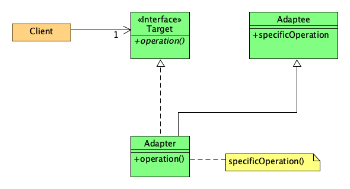
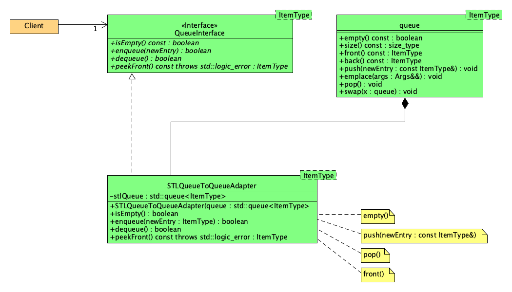

# LAB10 - Software Design Patterns: The Adapter Pattern
Explore queues and priority queues provided by the STL

## Background

In software engineering, the adapter pattern is a software design pattern (also known as wrapper, an alternative naming shared with the decorator pattern) that allows the interface of an existing class to be used as another interface.[1] It is often used to make existing classes work with others without modifying their source code.

The adapter[2] design pattern is one of the twenty-three well-known GoF design patterns that describe how to solve recurring design problems to design flexible and reusable object-oriented software, that is, objects that are easier to implement, change, test, and reuse.

In this lab, we'll use this pattern to address the following problem: How can a class be reused that does not have an interface that a client requires? That is, we seek to use the `queue` and the `priority_queue` but in a manner prescribed by the interfaces we find in our textbook.

The adapter design pattern describes how to solve such problems:

* Define a separate `adapter` class that converts the (incompatible) interface of a class (`adaptee`) into another interface (`target`) clients require.
* Work through an `adapter` to work with (reuse) classes that do not have the required interface.

The key idea in this pattern is to work through a separate `adapter` that adapts the interface of an (already existing) class without changing it.

Clients don't know whether they work with a `target` class directly or through an `adapter` with a class that does not have the `target` interface.

In the above UML diagram, we see a `Client` that interacts with some `Target`; it expects that target to have a method named `operation`. However, a class exists (`Adaptee`) that fulfills the needs, but the method it has for this particular responsibility is named differently (`specificOperation`). Thus, we build an `Adaptor` that can "adapt" the `Adaptee` to the needs of the `Client`.

By having the `Adapter` implement the `Target` interface, the `Adapter` gives the `Client` what it needs and expects. The way this is done is to have the `Adapter` maintain a reference to an instance of the `Adaptee` and simply _delegate_ the expected `Target` operations to this `Adaptee`.

## Objective

Your objective in this lab is to utilize the Adapter pattern to create an `Adapter` for the STL `queue` class, as prescribed by the following class diagram:

## Getting Started

After accepting this assignment with the provided [GitHub Classroom Assignment link](https://classroom.github.com/a/oR2nuJab), clone this repository. Push all your changes to the `master` branch. GitHub Classroom automatically creates a `feedback` branch and a pull request that seeks to merge the changes in your `master` branch into your `feedback` branch.

## Tasks

As usual, your tasks are guided by the `TODO` comments in the source code. In this case all your code will be found in [src/STLQueueToQueueAdapter.cpp](src/STLQueueToQueueAdapter.cpp).

### Part 1

Before you can create an adapter, you need to understand the API of the `Adaptee`, i.e., of the `std::queue<>` class template of the Standard Template Library (STL). Here are two great resources:

* [http://www.cplusplus.com](http://www.cplusplus.com/reference/queue/queue/queue/)
* [https://en.cppreference.com](https://en.cppreference.com/w/cpp/container/queue)

Take a few moments to read up on the public operations offered by the `queue` class.

### Part 2

Implement your `Adapter`. It is recommended that you commit your code changes after each of the following steps with an appropriate commit message.

1. Begin with the constructor. The `STLQueueToQueueAdapter` contains only one initializing constructor. Use an initializer list to initialize the `stlQueue` data member.
1. Implement the `isEmpty()` operation by delegating the work to the encapsulated `queue` data member.
1. Implement the `enqueue()` operation by delegating the work to the encapsulated `queue` data member. Note however that the underlying data member's corresponding operation does not return a boolean (it's a void operation). Thus, in this case, always return true in the end.
1. Implement the `dequeue()` operation by delegating the work to the encapsulated `queue` data member. Note however that the underlying data member's corresponding operation does not return a boolean (it's a void operation). Thus, take the appropriate action (i.e. decide how/when to return `true` or `false`).
1. Implement the `peekFront()` operation by delegating the work to the encapsulated `queue` data member. Note however that you are required to throw a `std::logic_error` (with an appropriate message) if the client asks to `peekFront()` on an empty queue.

## Submission Details

As usual, prior to submitting your assignment to Teams, be sure that you have committed and pushed your final changes to GitHub. Once your final changes have been pushed, submit the URL of your assignment _repository_ (i.e., _not_ the URL of the pull request) as a Link Resource in Teams. Please note: the timestamp of the submission on Teams is used to assess any late penalties if and when warranted, _not_ the date/time you create your pull request. **No exceptions will be granted for this oversight**.

### Due Date

Your Teams submission is due by 11:59 PM, Friday, November 6, 2020.

### Grading Rubric

This assignment is worth **3 points**.

Criteria          | Exceeds Expectations        | Meets Expectations             | Below Expectations | Failure                                                 |
------------------|-----------------------------|--------------------------------|--------------------|---------------------------------------------------------|
Pull Request (20%)| Submitted early, correct url| Submitted on-time; correct url | Incorrect URL            | No pull request was created or submitted          |
Code Style (20%)  | Exemplary code style        | Consistent, modern coding style    | Inconsistent coding style| No style whatsoever or no code changes present|
Correctness^ (80%)| All unit tests pass         | At least 80% of the unit tests pass| At least 60% of the unit tests pass| Less than 50% of the unit tests pass|

^ _The Google Test unit runner will calculate the correctness points based purely on the fraction of tests passed_.

### Late Penalty

* In the first 24 hour period following the due date, this lab will be penalized 0.6 point meaning the grading starts at 2.4 (out of 3 total possible) points.
* In the second 24 hour period following the due date, this lab will be penalized 1.2 points meaning the grading starts at 1.8 (out of 3 total possible) points.
* After 48 hours, the assignment will not be graded and thus earns no points, i.e., 0 out of 3 possible points.
