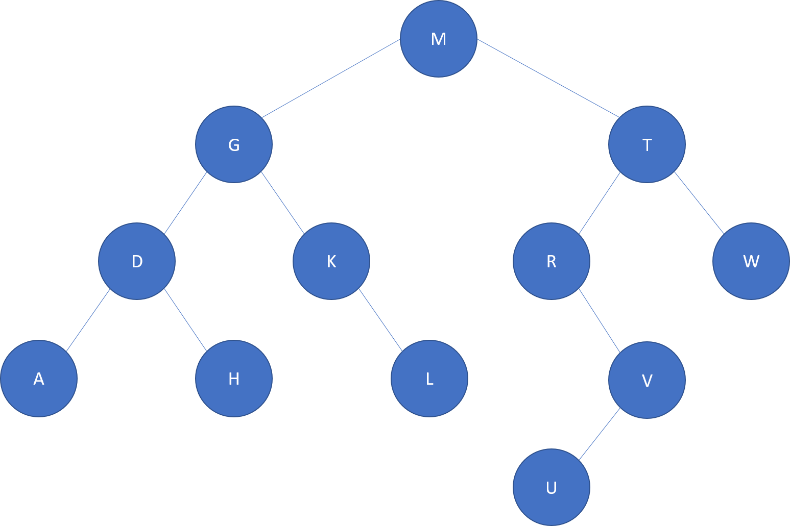

# Lab12 - Introduction to Trees

Lab 12 is an introduction to trees and tree traversals

## Background

Trees provide us with an ADT that provides us a convenient way to organize data in a hierarchical manner that is important to many applications. To process data in a tree, traversing the tree is essential. Intuitively, "traversing" a tree means to visit every node in the tree. Because the meaning of "visit" is application dependent, you can pass a client-defined `visit` function to the traversal operation.

### Tree Traversals

We explore three different algorithms for traversing trees in this lab. These tree-traversal algorithms are the _pre-order_ traversal, _in-order_ traversal and the _post-order_ traversal.

In this lab, we consider _binary trees_. Intuitively, we can define a binary tree recursively. A binary tree _T_ is either empty (i.e., it has no nodes) or is of the form:

```text
            root
           /    \
          /      \
Left-subtree     Right-subtree
```

If _T_ is empty, the traversal algorithm takes no action -- an empty tree is the _base case_. If _T_ is not empty, the traversal algorithm must perform three tasks: It must process (e.g., display) the data in the root _r_, and it must traverse the two subtrees _left-subtree_ and _right_subtree_, each of which is a binary tree smaller than _T_. We can summarize this logic using the following pseudocode:

```text
if (T is not empty)
{
    Display the data in T's root
    Traverse T's left subtree
    Traverse T's right subtree
}
```

Here we arbitrarily chose to visit the tree's root before traversing its subtrees. This general algorithm actually has three options for when we visit the root; it can visit _r_:

* Before it traverses both of _r_'s subtrees -- as we did above
* After it has traversed _r_'s left subtree but before it traverses _r_'s right subtree
* After it has traversed both of _r_'s subtrees

These choises result in **preorder**, **inorder**, and **postorder** traversals, respectively.

### Function Objects

As mentioned, what we do when we visit a node during a tree traversal is application dependent. Thus, it would be nice if we could "pass a function" to a tree traversal function that defines what to do when we visit a node. **Function objects** let us do just that.

An ingenious way to pass functions as parameters is to notice that an object contains both data and member functions, so we can define a class with no data and one member function, and pass an instance of the class. In effect, a function is being passed by placing it inside an object. This object is commonly known as a **function object**.

C++ function objects are implemented with some fancy syntax. We use _operator overloading_ on the function call operator named `operator()`. For example, if `cmp` was an instance of some class that overloaded the function call operator, it could be invoked as follows:

```c++
cmp.operator()(x, y);
```

But C++ allows us to simplify this to 

```c++
cmp(x, y); 
```

(In other words, it looks like a function call, and hence it's name "function call operator")

For example, suppose I wanted to create function object that could be used to conduct a case-insensitive comparison of two strings. 

```c++
#include <functional> // access to bool operator() and less()
#include <strings.h>
#include <vector>

// Generic findMax, with a function object, C++ style
// Pre-condition: a.size() > 0
template <typename Object, typename Comparator>
const Object & findMax( const std::vector<Object>& arr, Comparator isLessThan )
{
    int maxIndex = 0;
    for ( int i = 1; i < arr.size(); ++i )
        if( isLessThan( arr[ maxIndex ], arr[ i ] ) )
            maxIndex = i;
    return arr[ maxIndex ];
}

// Generic findMax, using default ordering
template <typename Object>
const Object & findMax( const std::vector<Object>& arr )
{
    // Note: second parameter is a function object
    return findMax( arr, std::less<Object>{ } );
}

class CaseInsensitiveCompare
{
public:
    bool operator( )( const std::string & lhs, const std::string & rhs ) const
    {
        return strcasecmp(lhs.c_str( ), rhs.c_str( ) ) < 0;
    }
};

int main( )
{
    std::vector<std::string> arr = { "ZEBRA", "alligator", "crocodile" };
    // Note: second parameter is a function object
    std::cout << findMax( arr, CaseInsensitiveCompare{ } ) << std::endl;
    std::cout << findMax( arr ) << std::endl;
    return EXIT_SUCCESS;
}
```

Note: the general format of the `strcasecmp()` function is

```c++
#include <strings.h>
int strcasecmp(const char *string1, const char *string2);
```

The `strcasecmp()` function returns a value indicating the relationship between the two (c-style) strings, as follows:

Value          | Meaning
---------------|--------
Less than 0    | `string1` less than `string2`
0              | `string` equivalent to `string2`
Greater than 0 | `string1` greater than `string2`

## Objectives

Upon successful completion of lab 12, the student will be able to

* traverse a binary tree in three different ways
    * pre-order traversal
    * in-order traversal
    * post-order traversal
* implement a "function object" that can be used to pass a function as a parameter

## Getting Started

After accepting this assignment with the provided [GitHub Classroom Assignment link](https://classroom.github.com/a/Ba6h93WC), clone this repository. Push all your changes to the `master` branch. GitHub Classroom automatically creates a `feedback` branch and a pull request that seeks to merge the changes in your `master` branch into your `feedback` branch.

## Tasks

There are essentially two tasks in today's lab. 

1. Get some practice with tree traversals
1. Study the concept of function objects by examining sample code and reading more online.

### Part 1 - Tree Traversal Exercises

In the space below (i.e., edit this file), write out what the preorder, inorder and postorder traversals of the binary tree shown below.



Pre - Root, left tree, right tree.
In - Left tree, root, right tree.
Post - Left tree, right tree, root.

1. Preorder: M G D A H K L T R V U W
1. Inorder: A D H G L K M U V R T W
1. Postorder: A H D L K G U V R W T M

### Part 2 - Study Functional objects

Study the code found in [demo.cpp](src/demo.cpp). Be sure you understand how it works, and in particular, how the function objects are defined. Additionally, read more [here](http://www.cplusplus.com/reference/functional/). Tap on the C++11 tab and take a look at some of the available operator classes (like `less` that is found in the demo code). 

## Submission Details

As usual, prior to submitting your assignment to Teams, be sure that you have committed and pushed your final changes to GitHub. Once your final changes have been pushed, create a pull request that seeks to merge the changes in your `feedback` branch into your `master` branch. Once your pull request has been created, submit the URL of your assignment _repository_ (i.e., _not_ the URL of the pull request) as a Link Resource in Teams. Please note: the timestamp of the submission on Teams is used to assess any late penalties if and when warranted, _not_ the date/time you create your pull request. **No exceptions will be granted for this oversight**.

### Due Date

Your Teams submission is due by 11:59 PM, Friday, November 20, 2020.

### Grading Rubric

This assignment is worth **3 points**.

Criteria          | Exceeds Expectations        | Meets Expectations             | Below Expectations | Failure                                                 |
------------------|-----------------------------|--------------------------------|--------------------|---------------------------------------------------------|
Pull Request (20%)| Submitted early, correct url| Submitted on-time; correct url | Incorrect URL            | No pull request was created or submitted          |
Code Style (20%)  | Exemplary code style        | Consistent, modern coding style    | Inconsistent coding style| No style whatsoever or no code changes present|
Correctness^ (80%)| All unit tests pass         | At least 80% of the unit tests pass| At least 60% of the unit tests pass| Less than 50% of the unit tests pass|

^ _The Google Test unit runner will calculate the correctness points based purely on the fraction of tests passed_.

NOTE: There is no code to write in this lab. Grading is purely based upon the accuracy of your tree traversals as written in this README (1 point per correct traversal).

### Late Penalty

* In the first 24 hour period following the due date, this lab will be penalized 0.6 point meaning the grading starts at 2.4 (out of 3 total possible) points.
* In the second 24 hour period following the due date, this lab will be penalized 1.2 points meaning the grading starts at 1.8 (out of 3 total possible) points.
* After 48 hours, the assignment will not be graded and thus earns no points, i.e., 0 out of 5 possible points.
